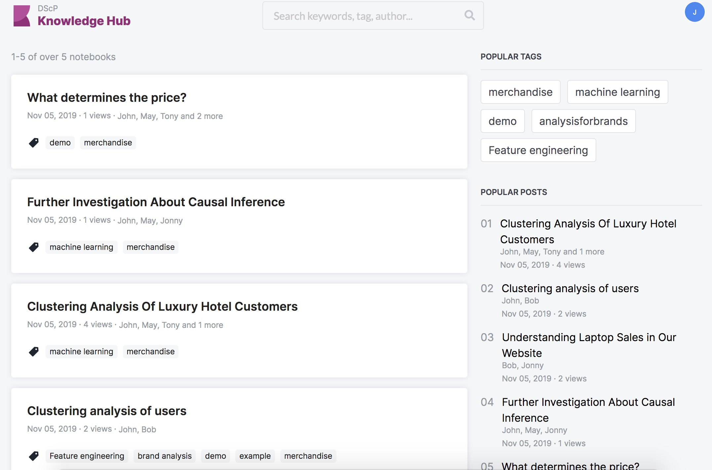
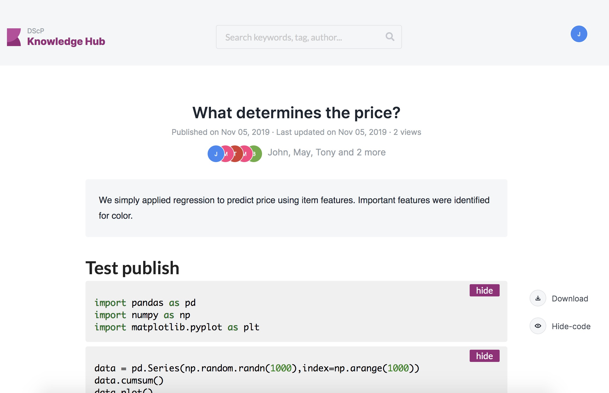

# Knowledge Hub -Frontend
Knowledge Hub is a platform for the data scientists to publish and share the data science work. Scientists can publish their Jupyter notebooks, find insights(including model data training/analysing use case, introducing model/API) here.
Guest(non-tech user) can browse related projects to find a way/possibility to solve problems with AI. <br>



<br>

---
## Installation
- **GIT repositoty installation:**
```shell
git clone
cd dsd-app-knowledge-hub
```

- **Packages installation:**
```
npm install
```

<br>

---

## Start working on the project
- **Runs the app in the development mode**

In the project directory, you can run:
```shell
yarn start
```
A simple node program for executing commands using an environment from an env file.<br>

Open [http://localhost:3000](http://localhost:3000) to view it in the browser.

The page will reload if you make edits.<br>
You will also see any lint errors in the console.

- **Runs unit test**
```shell
yarn test
```
Launches the test runner in the interactive watch mode.<br>
See the section about [running tests](https://facebook.github.io/create-react-app/docs/running-tests) for more information.

- **Build application in production mode**
```shell
export PUBLIC_URL=/ && npm rebuild node-sass && npm install && ./node_modules/.bin/env-cmd dev yarn build
```
Builds the app for production to the `build` folder. It correctly bundles React in production mode and optimizes the build for the best performance.
The build is minified and the filenames include the hashes. Your app is ready to be deployed!
See the section about [deployment](https://facebook.github.io/create-react-app/docs/deployment) for more information.

- **Build application in docker image**
```shell
docker build . -t knowledge-hub-app:1.0
```
- **Run application in container**
```shell
docker run -p 5000:5000 knowledge-hub-app:1.0
```
Open [http://localhost:5000](http://localhost:5000) to view it in the browser.

```shell
yarn eject
```
**Note: this is a one-way operation. Once you `eject`, you can’t go back!**

<br>

---

## GIT - commit changes & Pull request

All the latest updates are always in the `develop` branch. You should always follow these steps to send your latest updates:

We adapt [Fork & Pull](https://github.com/sevntu-checkstyle/sevntu.checkstyle/wiki/Development-workflow-with-Git:-Fork,-Branching,-Commits,-and-Pull-Request) to develop this project.

1. Fork this repo.
2. Clone source code from your repo.

When you finish your code and want to merge with master branch in main repository, make your changes locally and then add, commit, and push your changes to the `<feature>` branch:
```
git add .
git commit -m "adding a change from the feature branch"
git push origin <feature>
```

You can see all branches created by using :
```
git branch -a
```
Which will show :

- approval_messages
  master
  master_clean


Update your branch when the original branch from official repository has been updated :
```
git fetch [name_of_your_remote]
```
Then you need to apply to merge changes, if your branch is derivated from develop you need to do :

```
git merge [name_of_your_remote]/develop
```
Delete a branch on your local filesystem :

```
git branch -d [name_of_your_new_branch]
```

- **Pull request**

You should always create a `pull request` to merge your local branch with the remote into `develop` branch [only `develop` branch].

##### Read more about [Making a Pull Request in atlassian](https://www.atlassian.com/git/tutorials/making-a-pull-request)

<br>

---

## Branch name policy

Here are some branch naming conventions that I use and the reasons for them

##### Branch naming conventions:
- Use grouping tokens (words) at the beginning of your branch names.
- Define and use short lead tokens to differentiate branches in a way that is meaningful to your workflow.
- Use slashes to separate parts of your branch names.
- Do not use bare numbers as leading parts.
- Avoid long descriptive names for long-lived branches.
- Group tokens

##### Use "grouping" tokens in front of your branch names.

- group1/foo
- group2/foo
- group1/bar
- group2/bar
- group3/bar
- group1/baz

The groups can be named whatever you like to match your workflow. I like to use short nouns for mine. Read on for more clarity.

##### Short well-defined tokens

Choose short tokens so they do not add too much noise to every one of your branch names. I use these:

- wip       Works in progress; stuff I know won't be finished soon
- feat      Feature I'm adding or expanding
- bug       Bug fix or experiment
- junk      Throwaway branch created to experiment


Ream more about [commonly used practices for naming git branches in stackoverflow](https://stackoverflow.com/questions/273695/what-are-some-examples-of-commonly-used-practices-for-naming-git-branches)

<br>

---

## Dependencies

### 01. [React Avatar](https://github.com/sitebase/react-avatar)

We use React Avatar to generate avatars to display user avatars.

### 02. [Semantic UI React](https://react.semantic-ui.com/)

We use Semantic UI React to manipulate with style components.

###### You can find other dependencies in `package.json`

<br>

---

## Learn More

This project was bootstrapped with [Create React App](https://github.com/facebook/create-react-app).
You can learn more about creation React apps in the [Create React App documentation](https://facebook.github.io/create-react-app/docs/getting-started).<br>
To learn React, check out the [React documentation](https://reactjs.org/).
